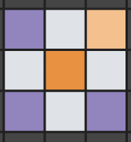

This is a bunch
of javascript I wrote which basically forms the backbone of this story: https://tmsnrt.rs/3hiJKGS

What the files do:

## layout.js

Inert middleware just to call the possible layouts. Currently only has a rectangular grid. A layout in general takes in parameters like cells per row, height, width, padding, etc. and returns x and y coordinates which are the top left corners of each "cell". It also returns the x and y extent of the layout.

## rect-grid.js

A normal rectangular grid. A kind of layout. It can also be an "alternating" style grid where each row sits in the "gaps" of the one above it. As above, returns x and y coordinates of the square/rectangular "cells".

Now wondering if layout and rect-grid should really be written with classes?

## cache-neighbours.js

This is a handy function when you have a number of grids and models running simultaneously on a webpage. Why this is needed is:

1. The model has to repeatedly query the neighbours of a cell to calculate whether to infect them or not.
2. The "cells" are basically a 1D array of javascript objects. But while finding the neighbours, we're working in 2d space:  
   

3. So to transform the 2D row and column number to a 1D index in the cell array, we can do some basic math. But that gets really expensive once you want to run thousands of them at the same time and animate a canvas.
4. So we cache the neighbour indexes for each possible grid configuration (n rows x m columns) we need. So we need to do computation only once and can reuse later.
5. Good thing about this is it can even be done preemptively before the user gets to any of the graphics.
6. I just add it to the window object. Not great practice. Ideally you'd want to have some sort of API to it that maintains closure on the object.

## herd-sim.js

This is the heart of the entire project: the model itself.
It takes a layout from layout.js (currently only works with a rectangular grid), and sets up the SIR model on that layout.

The API exposes a bunch of functions:

1. **setup**  
   Sets up the sim.

   - Randomly initialises nI number of infected, nV number of vaccinated and all others are susceptible. It can also do initialisations at predefined indexes if you pass the model a "initials" object.
   - It can do "special" categories if you want. They're basically inert and don't take part in the simulation.
   - Sets up neighbours of a cell. Using the cache if available. If not, caches it and then uses it so models in the future can reuse.
   - Sets up "long range connections": By default, 1/8th of the cells have an extra random neighbour that's not among the 8 surrounding it. These are super important when trying to get closer to a "mixed population" model using a rectangular lattice model.
   - Also sets up poor-vaccinations among the vaccinated individuals. Since vaccine efficacy is ~70%, this is 30% of the nV above.

2. **tickSim**  
   Runs the sim once. Which amounts to looping through every currently infected cell, going through it's neighbours and infecting them based on transmission probability.

3. **tickCount**  
   Returns the current tick count. Useful helper function while developing.

4. **reset**  
   Resets the sim! Kind of runs setup again. But in it's own way: If new parameters are passed to reset, it initialises using those instead. Otherwise, same as before.

5. **log**  
   Logs the _current_ stats of the model to the console:

   - Population
   - Vaccination
   - Infected
   - Removed
   - Susceptible
   - Vaccinated
   - Sanity: this checks if above numbers add up equal to population. Again, important while developing.

6. **fullRun**  
   If you just want to run the simulation to completeness (no more infected). It runs the above _tick_ function repeatedly. Useful if you just want to look at stats at the end and don't need to animate stuff based on the ticks.
