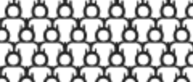

Code I wrote for all the graphics on this story: https://tmsnrt.rs/2VqS5PS

What the files do:

## alternate-distribution.js

An "alternating" rectangular grid. Where each cell sits in the gap between the two above it. Takes in parameters like cells per row, height, width, padding, etc. and returns x and y coordinates which are the top left corners of each "cell". It also returns the x and y extent of the layout.

   

## top-graphic.js

This is the main graphic on the page.

- It uses the above alternate-distribution.js to generate the grid.
- A css analog clock is already drawn on the page.
- The canvas isn't drawn fulled initially. Only the height of the screen. This gives the "increasing" and ticking effect to the reader. As the user scrolls, the canvas size increases.
- Problem with changing canvas size is that you need to redraw everything. This is fine on laptops/desktops but slows down significantly on the phone. Will talk about optimising it later.
- On scroll event Converts the page's scroll position within the top container to number of seconds, with the full length of the container being 24 _ 60 _ 60 seconds.

  It uses the calculated number of seconds for two things:

  - The time shown on the clock. Some basic trig to convert the hours to needle positions for mins, seconds and hours.
  - It also draws the approx number of people who would've died by this time in a day. So if 24 people die in 24 hours, and the scroll position translates to 18 hours, it would draw 18 people.
  - It is slightly clever when drawing people to prevent choking up the browser's render engine on phones (talked about above as to why): Using the screen width and height, it figures out how many "rows" of people will fit and only draws that number + 10 above and below it. This one optimisation resulted in a massive performance boost for me esp. on phones.

## svg-countdown.js

makeClock function that takes in parameters like target seconds, full clock extent, a container div, width, height etc. and generates a countdown timer clock. Can be either digital or analog clock. The story uses the digital one.
ALso has custom events:

- "clock-reset" event it calls when the timer resets.
- "clock-tick" on every second.

Returns an API that has start, stop and pause functions.

## countdown.js

Sets up the countdown clock. and adds a person icon to the container whenever that clock ticks. This was used to show how may people have dies since you opened the page.
