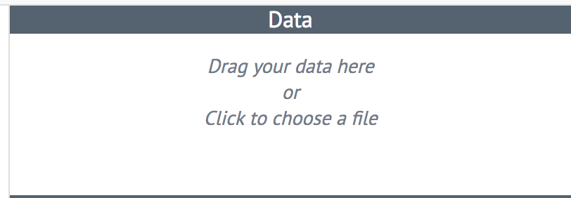
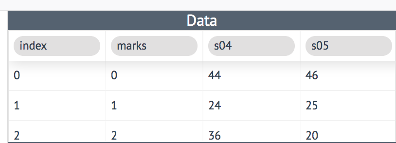
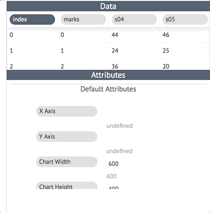
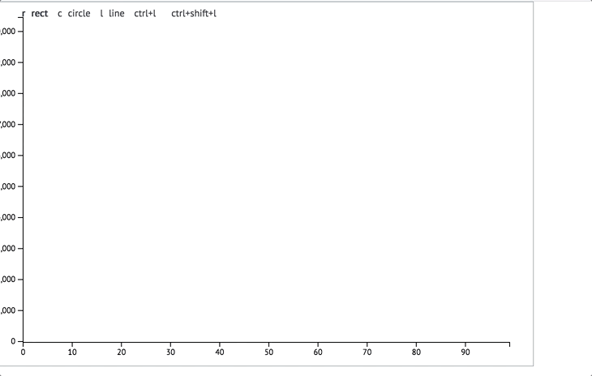
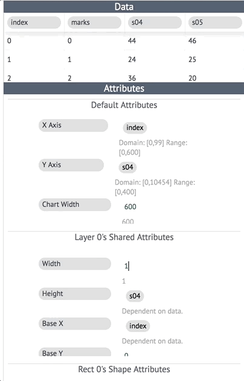
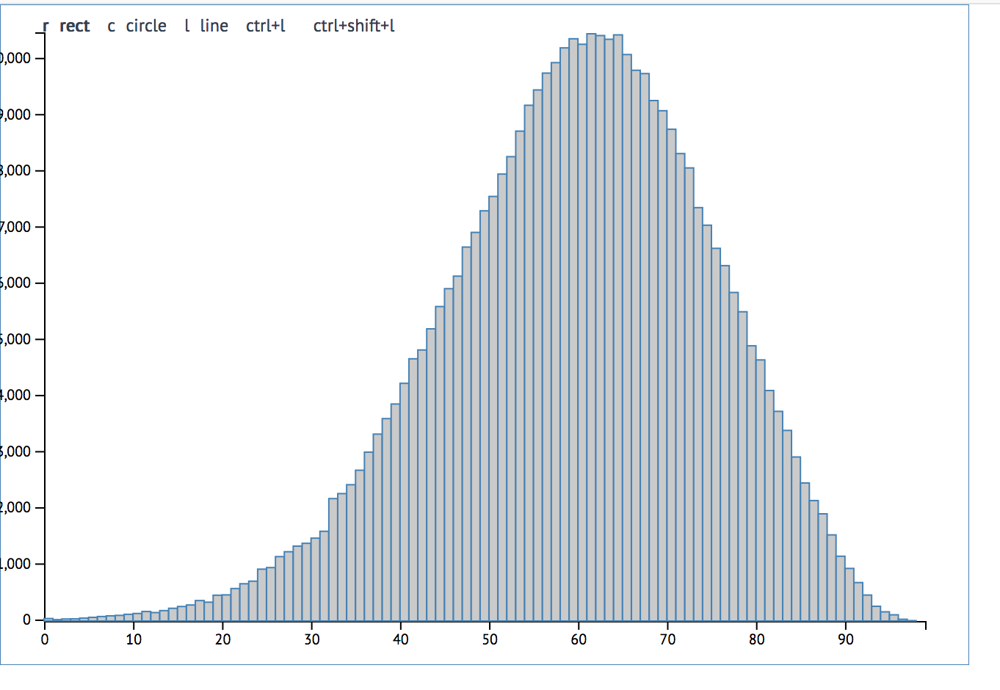

This contains code for my bachelor thesis project (BTP). This is a drawing tool for data visualization. My focus is on making an Illustrator like drawing interface for charts with the attributes (styles, width, radius, etc) of the graphic elements (circle, rectangle, etc.) being driven by data or relationships to other elements.

# A trip round the code

the src folder has teh followind subfolders:

- Actions: Redux actions
- Reducers: Again, for Redux. Seperated out into several sub categories to manage data, file and drawing actions.
- Util: has VARIOUS utilities for attirbute calculation, layer creation and maintining linked/dependent attributes. For eg if chart heigh depends on chart width to maintain an aspect ratio.
- Viz: Houses all the React components for the front end. Contains nested components for Axis, Chart, Individual shapes like rectangles, circles. The structure is:  
  Viz -> (one) Chart -> (several) Layers -> all individual elements like axis, shapes etc

# Inspirations

These are some of the tools that served as inspiration for my project. I have shamelessly not only taken ideas from them, but also implementation logic.

- [Apparatus](http://aprt.us/)
- [Bret Victor's talk on "Drawing Dynamic Visualization"](http://worrydream.com/DrawingDynamicVisualizationsTalkAddendum/)
- [Recursive drawing](http://recursivedrawing.com/)
- Adobe Illustrator

# Core principles

A lot of my principles are derived from the implementation of SVG as that is what this tool renders the charts in.

- Every visualization/chart can be broken down into fundamental shapes.
- A shape has dimensions and styles: both collectively called attributes.
- The attributes can be driven by data or be driven by relationships to other shapes.
- A visualization/chart is just this fundamental shapes looped over the entire dataset (if a dataset is used).

For example: A bar chart's fundamental shape is a rectangle. With the height and x-position being mapped to some data columns say, index and apples. So the height and x-position are it's dimensions that are driven by data. Once we defined this fundamental shape, we can loop over the entire data set to get a bar chart.

# Libraries used

- [React](https://github.com/facebook/react/) for rendering the SVG elements.
- [D3](https://github.com/d3/d3) for various chart elements like axis, colour schemes etc.
- [Redux](https://github.com/reactjs/react-redux/) for managing my state/logic.
- [Codemirror](https://github.com/codemirror/codemirror) and the beautiful [React-Codemirror2](https://github.com/scniro/react-codemirror2) for editing attributes and essentially making it alive.

# How to use this tool

I am still figuring out build configs for this to be able to be fast and small. Also have to work on many many logic fixes for it to work fast as well. So just beware.

Setting this up for using is pretty simple:

```
yarn
yarn start
```

To actually make a chart with it:

- Take the [avg_all.csv]() file from src/Things/Data/ and drag it to the data tab. You'll see it populates the tabs with your data.  
    
  

- Drag index and s04 column headers to the x and y axis respectively like so:  
  

- Now that your data and axes are setup, we can draw a chart using this. Click and drag your mouse on the canvas to draw a rectangle.
  

- Now in the attribute tab on the right, drag the index and s04 column headers to the rectangles "Base X" and "Height" attributes. Also make the Base Y 0. like so:


- For the width, delete the existinng "Width" attribute and drag the "Chart Width" attribute to the "Width" attribute of the rectangle. then type "/100" after it to fit 100 rectangles on the canvas. Notice how everything updates as you do these steps.



- That's it! All you gotta do now is press "Ctrl + L" (Cmd won't work on Macs unfortunately). And the tool will loop over every row and repeat what you just did for one rectangle for every row.  
  

`Warning`

The motive of this project for me was to learn and implement some of the ideas I've had of easing the process of telling stories with charts for the non-coding crowd, especially journalists. This might not be the perfect tool, but it may serve as a stepping stone for one.

And of course this tool itself is open source so do whatever you want with it.
